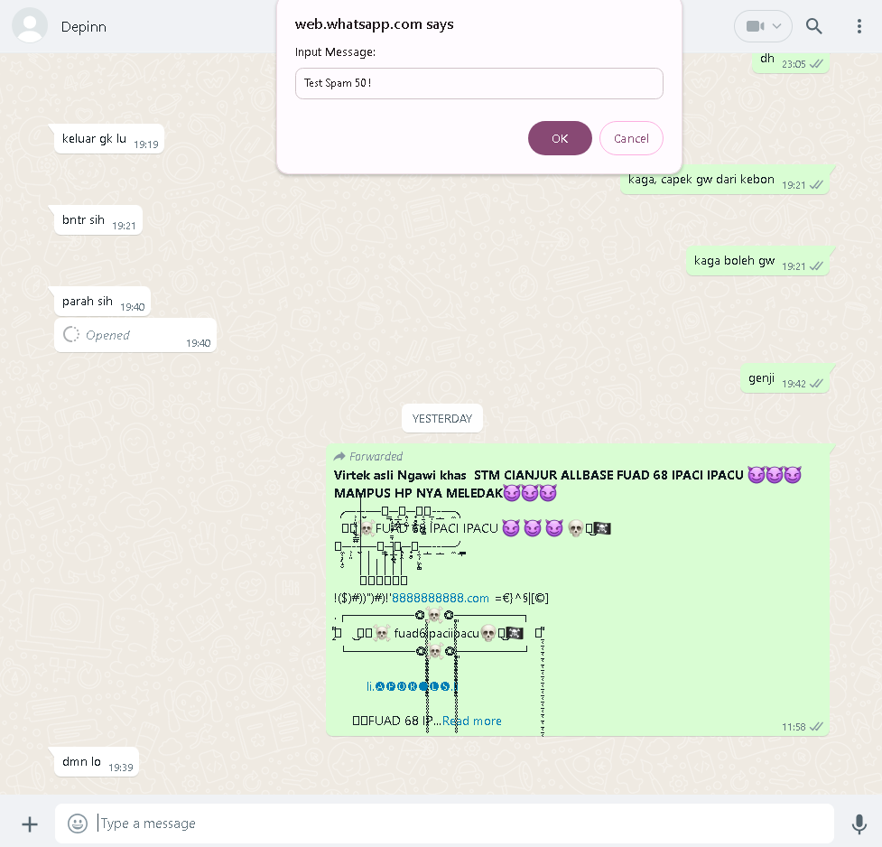
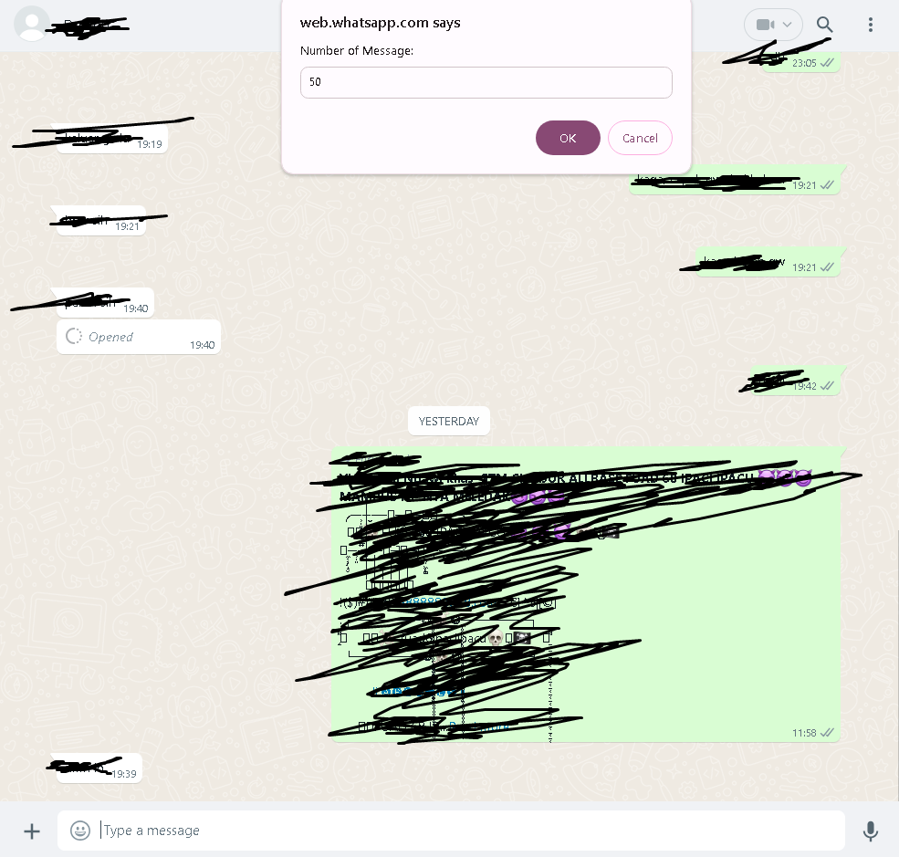
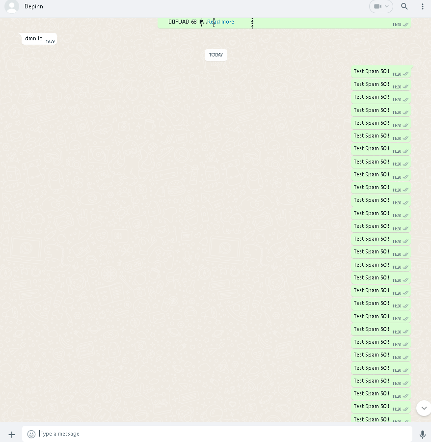
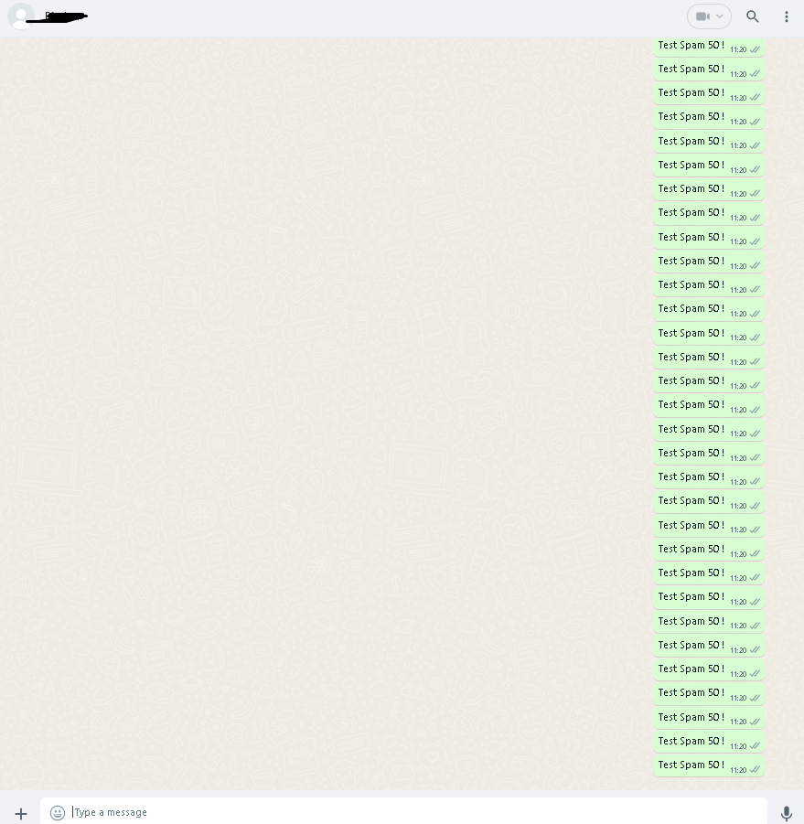

# DevSpam

> **Disclaimer:**
> I do not take any responsibility. This script is for educational purposes only.

---

## 🚀 How to Use?

1. Copy the code from `Spam.js`.
2. Open **WhatsApp Web**.
3. Open a **Chat** or **Group**.
4. Open **Developer Console** (`Ctrl + Shift + I`).
5. Paste the copied code into the console.
6. Click on the message column (A pop-up will appear).

### ⚠️ Note:
After you're done spamming, **clear the console and reload WhatsApp Web** to reset the session.

---

## 📌 Preview

### Input the Message

### Input Number of Messages

### Spam Result

---

## ☕ Support Me

If you find this script useful, consider supporting me:

