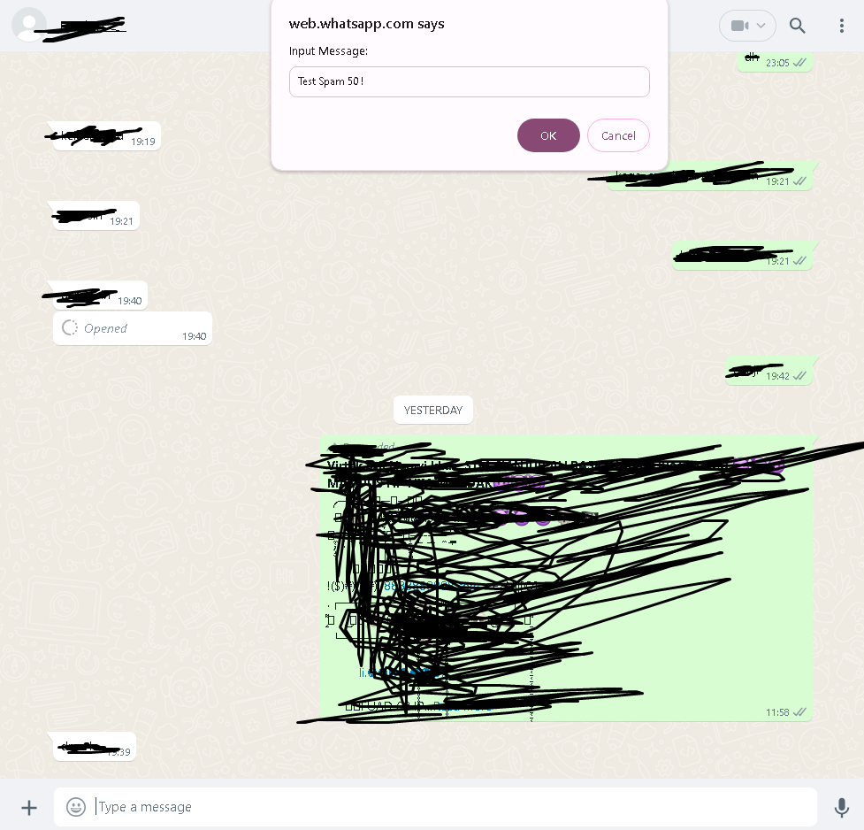
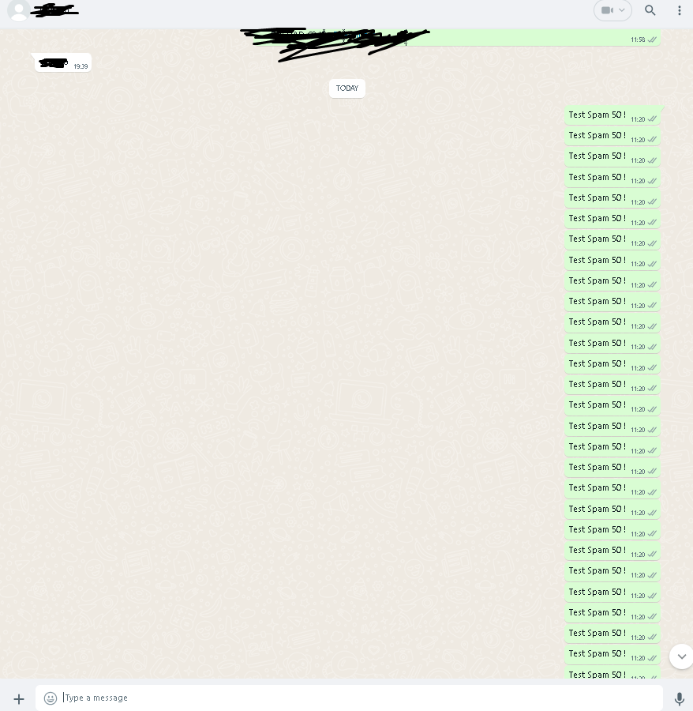

# devspam
I don't take any responsibility, it's for education only

<h2>How to Use ?</h2>
<li>Copy Code from Spam.js</li>
<li>Open WhatsApp Web</li>
<li>Open Chat or Group (Want to Spam)</li>
<li>Open Dev Console (ctrl + shift + i)</li>
<li>Paste the code to dev console</li>
<li>And Click Anywhere (Pop up will appear)</li>

<li>Note :</li>

If Done Spamming, clear console and reload WhatsApp Web

<h2>Here The Result</h2>

Input The Message

Input Number of Message

Spam Result

<h2>Donate Me : </h2>
<a href="https://saweria.co/raiinime">Thanks For Donate</a>
